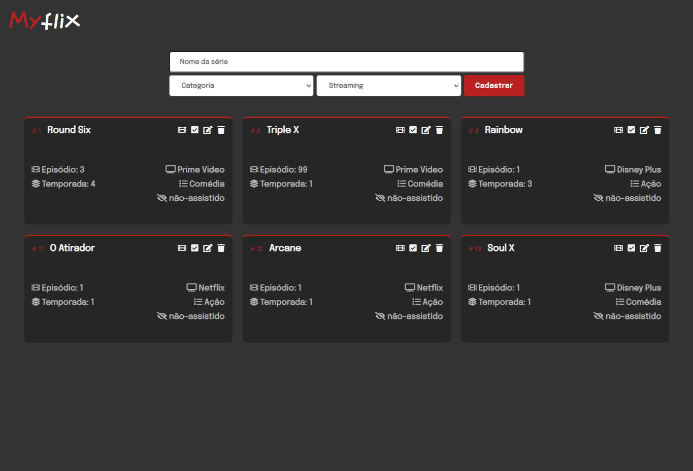

<h1 align="center">:ok_woman: MyFlix :heavy_check_mark:</h1>

Projeto desenvolvido na Disciplina de Programação para web 2021/2 com turmas de ADS e Ciência da Computação Grupo UNIS

      

## ✨ Tecnologias

Esse projeto foi desenvolvido com as seguintes tecnologias:

- [Laravel](https://laravel.com/)
- [VueJs](https://vuejs.org/)
- Para mais detalhes, veja o <kbd>[package.json](./package.json)</kbd>